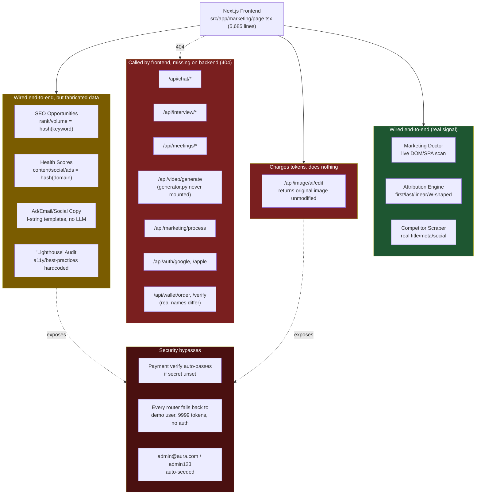

# Aura Marketing AI OS — Digital Marketing Capability Review

**Reviewed:** `AI agent/` (Next.js 16 + FastAPI, "Aura Marketing AI Operating System" v2.1.0)
**Reviewer scope:** All backend routers, `database.py`, `auth.py`, `generator.py`, the 5,685-line `src/app/marketing/page.tsx`, login/signup pages, the existing `generate_pdf.py` self-review, and endpoint-by-endpoint frontend↔backend contract matching.

---

## 1. Direct Answer

This is a well-organized **prototype/demo shell**, not an operable digital marketing platform. It looks like a legitimate all-in-one marketing OS (SEO doctor, ad builder, video studio, campaign attribution, payments) and a few pieces are genuinely solid engineering. But underneath, most of the "AI" and "data" is fabricated or templated, several paid features are non-functional while still charging credits, a large slice of the UI calls backend endpoints that don't exist, and there are real security holes (free wallet-token minting, no-auth-required paid endpoints, default admin login). **It is not safe to run real ad spend, real client SEO decisions, or real payments through it as-is.**

An internal report already sitting in the repo (`generate_pdf.py`, output: `Aura_Marketing_Full_Codebase_Architecture_Review.pdf`) rates the product 6.5–7/10 and claims upgrades are "Implemented & Verified." That self-review does not surface any of the issues below — it evaluates architecture, not whether the marketing outputs are real.

---

## 2. What's Actually Good

| Area | Evidence | Verdict |
|---|---|---|
| Router architecture | `main.py` mounts 8 clean domain routers (auth, wallet, image, webaudit, analytics, marketing_doctor, seo_engine, campaigns) | Solid separation of concerns |
| DB resilience | `database.py` has a full in-memory fallback (`InMemoryCollection`/`InMemoryDatabase`) that emulates `$inc`/`$push`/`$set` if MongoDB is unreachable | Genuinely good — app degrades gracefully instead of crashing |
| Multi-touch attribution | `campaigns.py` `/attribution/{campaign_id}` correctly computes First-Touch, Last-Touch, Linear, and W-Shaped models over a real `db.touchpoints` event stream | Real, correctly implemented marketing-analytics algorithm — this is the single best piece of "marketing" logic in the codebase |
| Live technical SEO signals | `marketing_doctor.py` does a real `httpx` GET + BeautifulSoup parse: title, meta description, H1, Schema.org JSON-LD, and Next.js/Vue SPA hydration detection via `__NEXT_DATA__` | Genuinely useful, real signal — not fabricated |
| Competitor scraping | `webaudit_router.py` `/competitor/analyze` really fetches and parses the competitor's title, meta description, and social links | Real, small but useful |
| Auth foundations | bcrypt password hashing + JWT (`auth.py`) is structurally correct | Sound pattern, undermined by issues in §4 |
| Payment flow shape | Razorpay order-create + HMAC signature verification (`wallet_router.py`) follows Razorpay's actual verification formula | Correct shape, undermined by a bypass in §4 |
| Copy quality | Ad creatives, social calendar, and email sequences read like professionally written marketing copy | Good starting-point drafts, not generated per-input (see §3) |
| Test coverage | 5 passing unit tests cover auth, payment verification, marketing-doctor scan, and attribution | A real, if thin, safety net |

---

## 3. What's Fabricated, Not What It Claims to Be

This is the core problem for "digital marketing requirements": most of the *intelligence* is fake, dressed up as AI/data output.

- **No LLM anywhere.** A full grep for OpenAI/Anthropic/Gemini/GPT across the backend returns zero hits in actual product code. Every "AI-generated" headline, caption, email, and SEO fix is a Python f-string template with the product name substituted in (`campaigns.py` lines 133–275, `seo_engine.py` lines 183–262). Ask it to write copy for two different products and you'll get the same three ad templates with different nouns dropped in.
- **No ad platform integration.** `channels: ["google_ads", "meta_ads", "linkedin", "email"]` are just labels used to split a budget number (`campaigns.py` line 57). There is no Google Ads API, Meta Marketing API, or LinkedIn Ads API call anywhere — nothing is ever actually published to a real ad account.
- **No real keyword/rank data provider.** No SEMrush, Ahrefs, DataForSEO, Moz, or Google Search Console integration exists. "Current rank #14," "search volume 12,100," and "why you're not in the Top 10" content gaps (`seo_engine.py`) are generated from `sum(ord(c) for c in keyword)` — a checksum of the string you typed, not real SERP data. It will confidently report the same fake ranking data for a domain that doesn't even exist.
- **Marketing Doctor's health score is half real, half fake.** SEO/conversion scores use real DOM signals. But content, social, ads, and AI-search scores (`marketing_doctor.py` lines 179–183) are also `domain_hash`-derived — a hash of the domain name masquerading as a content/social/ads audit. A business owner reading "Content Score: 74/100" has no way to know that number came from hashing their URL string.
- **"Lighthouse" audit isn't Lighthouse.** `webaudit_router.py` hardcodes accessibility at 88 and best-practices at 90 for every single site, regardless of actual content (lines 61–62). Only performance is loosely derived from one HTTP latency sample.
- **Analytics dashboard is static.** `daily_token_usage` in `analytics_router.py` is a hardcoded 7-day array, not derived from real usage. No GA4 or Meta Pixel ingestion exists anywhere, despite "GA4" appearing as a label in the fake competitor tech-stack output.

---

## 4. What's Broken or Actively Risky

**Non-functional paid features:**
- `image_router.py` `/api/image/ai/edit` deducts 3–10 tokens per call and then does this: `result_url = req.source_url` — it returns the user's original, unedited image and charges them anyway (line 97). There is no real Stability AI/Clipdrop/Cloudinary call despite the env vars and cost table existing.
- `generator.py` (the AI Video Studio: Replicate integration + sandbox video fallback) is never imported into `main.py`. It's dead code — there is no `/api/video/generate` route on the server at all.

**Frontend calls endpoints that don't exist on the backend** (confirmed by grepping every `fetch(` in `marketing/page.tsx`, `login/page.tsx`, `signup/page.tsx` against every `@router.` in the backend):

```
/api/chat/channels, /api/chat/messages          → no chat backend exists
/api/interview/questions, /evaluate-answer,
  /generate-scorecard, /schedule-email          → no interview backend exists
/api/meetings/scheduled, /api/meetings/schedule → no meetings backend exists
/api/video/generate                             → generator.py exists but is never mounted
/api/marketing/process                          → the generic "run a task, deduct tokens" endpoint doesn't exist
/api/image/generate, /api/image/gallery         → don't exist (only /api/image/ai/* does)
/api/auth/google, /api/auth/apple               → Google/Apple sign-in buttons call nothing real
/api/wallet/order, /api/wallet/verify           → real routes are named /create-razorpay-order, /verify-payment
```

Chat, interview practice, and meeting scheduling have nothing to do with digital marketing — they look like leftover scaffolding from a different template (interview-prep or team-chat app) that was never removed. In its current state, a real user clicking "Generate AI Video," "Sign in with Google," or opening the chat/interview panels gets a failed fetch, not a working feature.

**Security issues that matter once real money or real client data is involved:**
- `wallet_router.py` line 119–120: if `RAZORPAY_KEY_SECRET` is unset — which is exactly the state of the current `.env` — payment signature verification auto-passes (`is_valid = True`). Anyone who can call `/verify-payment` directly can credit themselves unlimited wallet tokens for free.
- Every router's `get_current_user_helper` (repeated in `campaigns.py`, `marketing_doctor.py`, `seo_engine.py`, `webaudit_router.py`, `image_router.py`, `analytics_router.py`, `wallet_router.py`) silently falls back to a hardcoded `demo.user@aura.com` account with `9999` tokens whenever no or an invalid bearer token is supplied. Every paid feature is usable with zero authentication.
- `main.py` auto-seeds a default `admin@aura.com` / `admin123` account on every startup if one doesn't exist.
- CORS allows `allow_origins=["*"]` together with `allow_credentials=True` — an invalid/unsafe combination that also signals this was never tested against a real deployed frontend origin.
- `auth.py` has a hardcoded fallback JWT signing secret baked directly into source if the `SECRET_KEY` env var is absent.

---

## 5. Architecture: Real vs. Fabricated vs. Dead



---

## 6. Scorecard Against Real Digital-Marketing Requirements

| Requirement | Status |
|---|---|
| Publish real ads to Google/Meta/LinkedIn | ❌ Not present — budget splitting only, no ad platform API |
| Real keyword/rank tracking (Ahrefs/SEMrush/GSC-class data) | ❌ Fabricated via string hashing |
| Genuinely AI-generated, per-input copy | ❌ Static templates, no LLM call anywhere |
| Website technical health diagnostics | ⚠️ Partially real (DOM presence checks); most sub-scores fabricated |
| Multi-touch attribution modeling | ✅ Real, correctly implemented — needs a real event pipeline feeding it |
| Competitor intelligence | ✅ Real scraping, but SWOT text is a fixed template regardless of findings |
| AI image editing | ❌ No-op that still charges tokens |
| AI video generation | ❌ Built but not wired into the server; falls back to stock footage when it is |
| Payments/monetization | ⚠️ Correct shape, but has a live signature-bypass hole in its current config |
| Auth/access control on paid features | ❌ Defaults to an unauthenticated demo account with unlimited tokens |
| Frontend/backend contract integrity | ❌ ~12 frontend flows call nonexistent backend routes |

---

## 7. Recommended Actions (priority order)

1. **Stop charging for `/api/image/ai/edit`** until it calls a real provider — either wire up Clipdrop/Stability/Cloudinary for real, or remove the charge and mark it "coming soon."
2. **Close the payment bypass**: require `RAZORPAY_KEY_SECRET` to be set before accepting any `/verify-payment` call in anything other than local dev; fail closed, not open.
3. **Remove the unauthenticated demo-user fallback** from every router's `get_current_user_helper`, or gate it strictly behind a `DEBUG`/dev-only flag.
4. **Delete or finish the dead frontend flows** (chat, interview, meetings, video, `/api/marketing/process`, Google/Apple sign-in, and the wallet path mismatches) — right now they're silent dead ends for real users.
5. **Decide what "AI" means here** and actually call an LLM for copy generation, or relabel the feature as "templates" — the current framing overstates what the product does.
6. **Replace or clearly label the hashed SEO/health scores** as illustrative/demo data until a real keyword-data provider (DataForSEO is the cheapest integration path) is connected — presenting fabricated ranking data as real diagnostics is a trust and potentially legal-liability issue once shown to paying customers.
7. **Fix CORS** to a real allowlist of deployed origins once `allow_credentials=True` is needed.

---

## 8. Assumptions & Open Questions

- **Assumed**: this codebase is pre-launch/internal, since default admin credentials and a payment bypass are still live in `.env`. If this is already deployed publicly, items 1–3 above are urgent, not just recommended.
- **Open question**: is the intent to eventually wire a real LLM + real ad/SEO data providers, or is the "AI" framing itself meant to be aspirational/demo-only for now? That materially changes how much of this needs fixing versus relabeling.
- Not reviewed in depth due to size: the full 5,685-line `marketing/page.tsx` UI logic beyond its `fetch()` call sites, and the `.next` build output.
