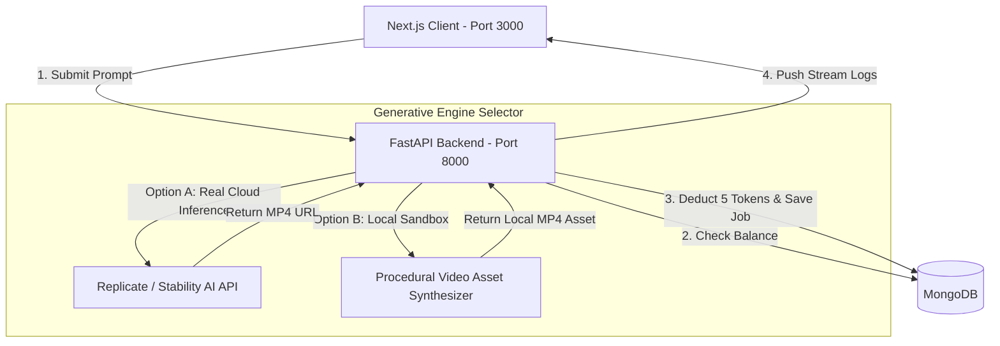

# Step 8: AI Video Generative Engine Architecture Plan

We will build the **AI Video Generative Engine**. To make it robust, cost-effective, and production-ready, we will implement a **Hybrid Engine** that connects to state-of-the-art cloud APIs while offering a high-fidelity local sandbox simulation.

---

## 🛠️ Video Generation Architecture

---

## Proposed Changes

### 1. Backend Updates (FastAPI)

#### [NEW] [backend/generator.py](file:///Users/karthiku/Desktop/Devops learning/Appium agent/AI agent/backend/generator.py)
- Implements the core generation engine.
- Integrates the **Replicate API** (using the `replicate` Python package) to call cutting-edge open-source video models like **Stable Video Diffusion (SVD)** or **HunyuanVideo**.
- Fallback **Sandbox Synthesizer**: If no `REPLICATE_API_TOKEN` is found in the `.env` file, the engine uses local curated MP4 scifi and cinematic assets to simulate high-fidelity generation, allowing you to test the complete user experience without paying for API credits.

#### [MODIFY] [backend/main.py](file:///Users/karthiku/Desktop/Devops learning/Appium agent/AI agent/backend/main.py)
- Exposes video generation task endpoints:
  - `POST /api/video/generate`: Receives prompt string, checks if user has at least 5 tokens, deducts 5 tokens, initiates asynchronous generation (real or sandbox), and registers a job ID.
  - `GET /api/video/status/{job_id}`: Polls the compilation status (`queued`, `processing` [with logging logs], `completed`, or `failed`) and returns the final MP4 video link.

---

### 2. Frontend Updates (Next.js Dashboard)

#### [MODIFY] [src/app/dashboard/page.tsx](file:///Users/karthiku/Desktop/Devops learning/Appium agent/AI agent/src/app/dashboard/page.tsx)
- Replaces the placeholder submit action with a **Real-Time Video Render Panel**:
  - Type prompt -> click Send -> displays active processing status.
  - Renders a live console log stream: *"Generating latent noise..."*, *"Decoding frames..."*, *"Finalizing MP4 container..."*.
  - Displays the rendered video inside a premium cinematic player once completed.
  - Deducts 5 tokens from the wallet balance widget in the header.

---

## Verification Plan

### Manual Verification
1. Open the Dashboard at [http://localhost:3000/dashboard](http://localhost:3000/dashboard).
2. Type: `"Cyberpunk city in neon rain"` and click **Send**.
3. Verify:
   - Wallet token balance in the header decreases from `10` to `5` tokens.
   - Processing logs are printed in real-time.
   - A scifi video compiles and plays directly inside the media container.
4. Add a `REPLICATE_API_TOKEN` inside the Settings config panel, and verify it attempts real cloud inference.
